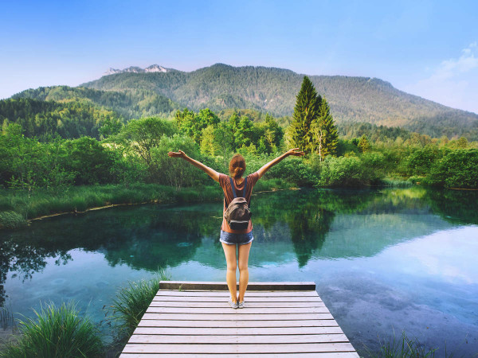
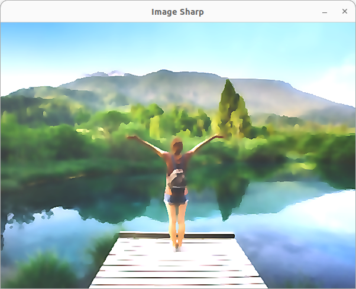

# picture-to-art-openCV
In this project, we will turn an image into a water colour based art

## Algorithm
1. Start the project by including dependencies.
2. Load the image
3. Resize the image using `interpolation`
4. Remove impurities using `medianBlur`
5. Use Bilateral filter
6. Sharpen the image using `GaussianBlur` and then subtract it from the filtered image
7. Display the images

## Stack
1. python3 
2. numpy 
3. opencv 

## Run
1. Download the files in a directory 
2. Open terminal in that directory 
3. Run the command `$ python3 art.py`

## Input

## Output

